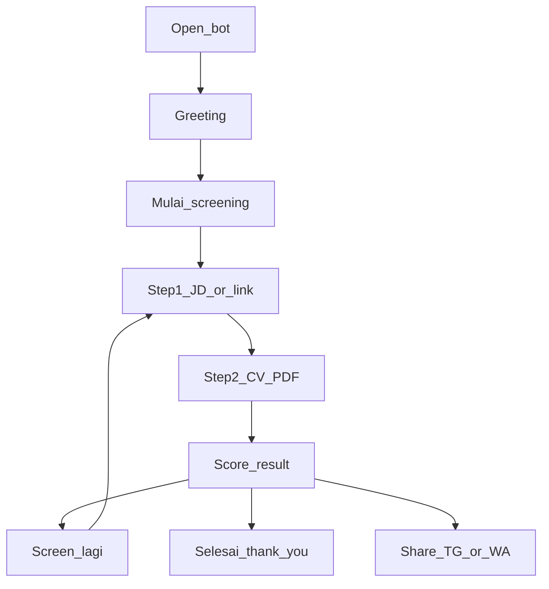

# CV Screener — Candidate Experience Design (Draft)

> **Product direction:** Primary user is now **HR / hiring manager**. See [`HR_DESIGN.md`](./HR_DESIGN.md). This candidate doc is kept as archive / alternate persona.

**Product:** Telegram bot `@cv_screener_bot`  
**Primary user:** Job seeker / candidate  
**Goal:** Cek cepat kecocokan CV vs 1 JD sebelum apply  
**Channel:** Telegram only (MVP)

---

## 1. Persona

**Candidate (primary)**  
- Sedang apply / bandingkan beberapa lowongan  
- Butuh jawaban cepat di HP  
- Tidak mau isi form panjang  
- Sering copy JD dari JobStreet/LinkedIn/career page  

**Jobs to be done**
1. “Apakah CV saya cocok ke JD ini?”
2. “Keyword apa yang kurang?”
3. “Bisa share tool ini ke teman?”

---

## 2. Design principles

1. **One job per screen** — tiap pesan = 1 tujuan (minta JD / minta CV / tampilkan hasil)
2. **Mobile-first chat** — teks pendek, bold untuk hierarki, tombol besar
3. **Forgiving** — jawaban salah tidak dihukum; diarahkan ulang
4. **Trust & privacy** — CV tidak disimpan ke disk; sampaikan singkat di help/about
5. **Brand always visible** — footer + link share di momen penting

---

## 3. Brand (candidate-facing)

| Element | Spec |
|---|---|
| Name | CV Screener |
| Handle | `@cv_screener_bot` |
| Link | https://t.me/cv_screener_bot |
| Tone | Ramah, jelas, sedikit formal — seperti temen HR yang helpful |
| Visual | Botpic logo “CV” (sudah ada di `assets/cv-screener-botpic.png`) |
| Language | Campur ID + EN ringan (Thank you / Done using) |

**Share surfaces**
- Telegram share picker
- WhatsApp prefilled text + bot link  
  *(recommended UI: dua tombol terpisah)*

---

## 4. Candidate journey (happy path)

```text
Open bot
  → Greeting (/start)
  → Mulai screening
  → Step 1: JD (paste atau link)
  → Step 2: Upload CV PDF
  → Hasil score + matched/missing
  → Screen lagi | Selesai | Share
```



---

## 5. Screen inventory (chat UI)

### A. Greeting (`/start`)
**Purpose:** Orientasi + CTA  
**Content**
- Halo / welcome
- Apa yang bot lakukan (1 kalimat)
- 3 langkah singkat
- Branding footer  

**Actions**
- `[Mulai screening]` `[Bantuan]`
- `[Batal]` (opsional di greeting bisa disembunyikan)
- `[Share Telegram]` `[Share WhatsApp]`

---

### B. Step 1 — Job description
**Purpose:** Ambil kriteria target  
**Content**
- Judul: Step 1/2
- Instruksi: paste JD **atau** link career page
- Tip: Requirements saja
- Batasan: LinkedIn/JobStreet sering gagal  

**Actions**
- `[Batal]`

**States**
| State | Behavior |
|---|---|
| Valid paste | Simpan → Step 2 |
| Valid link | “Mengambil JD…” → sukses/gagal |
| Link gagal | Jelaskan + minta paste manual |
| Unrelated text/media | Soft reject + ulang instruksi |

---

### C. Step 2 — CV PDF
**Purpose:** Ambil CV  
**Content**
- Judul: Step 2/2
- Minta file PDF saja
- Privacy one-liner (opsional): “CV diproses di memori, tidak disimpan.”  

**Actions**
- `[Batal]`

**States**
| State | Behavior |
|---|---|
| PDF valid | “Memproses CV…” → hasil |
| Non-PDF / foto / voice | Minta PDF lagi |
| PDF scan/empty text | Error OCR + retry |
| Terlalu besar (>5MB) | Error size |

---

### D. Result
**Purpose:** Jawaban utama kandidat  
**Layout**
```text
Hasil screening
Score: XX%
n/m keywords dari JD

Matched
• …

Missing
• …

Tip: …

[Done using / Thank you — hanya jika user selesai, atau soft close]
Brand + share
```

**Actions**
- `[Screen lagi]` `[Selesai]`
- `[Share Telegram]` `[Share WhatsApp]`

**Score bands (copy suggestion)**
| Score | Label copy |
|---|---|
| 0–39% | Gap masih besar — prioritaskan keyword missing yang relevan |
| 40–69% | Cukup mendekati — rapikan CV sebelum apply |
| 70–100% | Match kuat — siap apply, tetap cek missing penting |

---

### E. Done / Thank you
**Purpose:** Penutup sesi  
**Content**
- Done using CV Screener
- Thank you
- Semoga apply lancar
- Brand + share  

---

### F. Idle / unrelated
**Purpose:** Redirect tanpa mengganggu  
**Content**
- Bot khusus screening CV vs JD
- CTA mulai / bantuan  

---

## 6. Button layout (recommended)

**Home / idle**
```text
[ Mulai screening ] [ Bantuan ]
[ Share Telegram  ] [ Share WhatsApp ]
```

**In-flow (Step 1–2)**
```text
[ Batal ]
```

**After result**
```text
[ Screen lagi ] [ Selesai ]
[ Share Telegram ] [ Share WhatsApp ]
```

---

## 7. Content voice examples

**Greeting**  
> Halo! Selamat datang di CV Screener.  
> Cek seberapa cocok CV kamu dengan job description dalam hitungan detik.

**Encourage after low score**  
> Score masih bisa dinaikkan. Tambahkan keyword yang memang sesuai pengalamanmu — jangan asal isi.

**Privacy (help/about)**  
> CV PDF diproses di memori dan tidak disimpan ke server sebagai file.

---

## 8. Out of scope for candidate MVP

- Login / akun kandidat  
- Simpan history score  
- Multi-JD ranking dashboard  
- Apply langsung ke perusahaan  
- OCR CV scan  
- LinkedIn auto-scrape  

---

## 9. Success metrics (candidate)

| Metric | Target arah |
|---|---|
| Start → selesai 1 screening | Tinggi |
| Drop di Step 1 (link gagal) | Turun (fallback paste jelas) |
| Share TG/WA taps | Monitoring adopsi viral |
| Retry “Screen lagi” | Signal value |

---

## 10. Implementation status vs this design

| Design item | Status di bot sekarang |
|---|---|
| Greeting + steps | Ada |
| JD paste + link | Ada |
| CV PDF only + off-topic handling | Ada |
| Result matched/missing | Ada |
| Done / thank you | Ada |
| Share Telegram picker | Ada |
| Share WhatsApp button | Perlu dipastikan live (tambahan terpisah) |
| Score band labels (rendah/sedang/tinggi) | Belum |
| Privacy one-liner di Step 2 | Belum |
| Home keyboard tanpa “Batal” di greeting | Partial (masih ada Batal) |

---

## 11. Next design iterations (optional)

1. Score band copy (Low / Medium / High)  
2. Privacy line di Step 2  
3. Tombol Share WhatsApp + Telegram terpisah di semua keyboard utama  
4. `/examples` kirim contoh JD + sample flow  
5. Ringkas “top 3 missing” saja untuk hasil lebih actionable  
