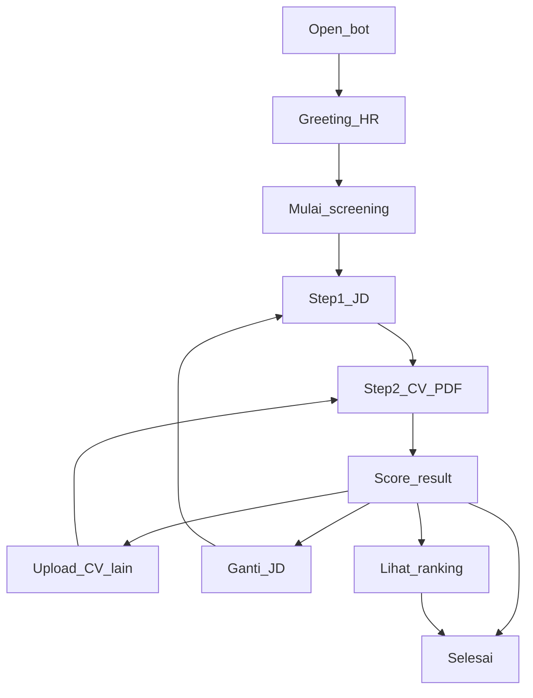

# CV Screener — HR Experience Design

**Product:** Telegram bot `@cv_screener_bot`  
**Primary user:** HR / hiring manager (recruiter or team lead)  
**Goal:** First-pass filter — cek cepat kecocokan CV kandidat vs 1 job posting (JD)  
**Channel:** Telegram only  
**Language:** Campur ID + EN (sama seperti bot sekarang)  
**Scoring:** Deterministic rule-based keyword match; optional AI explanation only

> Status: design + implemented in bot (Phase 0–2). Lihat gap table di bagian akhir.

---

## 1. Persona

**HR / hiring manager (primary)**  
- Punya 1 open role, banyak CV masuk  
- Butuh jawaban cepat di HP (Telegram)  
- Tidak mau buka ATS / spreadsheet dulu untuk rough filter  
- Sering paste JD dari career page / internal posting  

**Jobs to be done**
1. “Cocokkah CV kandidat ini ke JD saya?”
2. “Keyword apa yang kurang — layak ditanya di interview?”
3. “Dari beberapa CV yang saya screen, siapa paling match?”
4. “Bisa share tool ini ke tim hiring?”

---

## 2. Design principles

1. **One job per message** — tiap pesan = 1 tujuan (minta JD / minta CV / tampilkan hasil)
2. **Mobile-first chat** — teks pendek, bold untuk hierarki, tombol besar
3. **JD sticky** — selama multi-CV screening, JD tidak perlu di-paste ulang
4. **Honest first-pass** — skor keyword, bukan keputusan hiring final; copy harus jujur soal batasan
5. **Forgiving** — input salah diarahkan ulang, tidak dihukum
6. **Trust & privacy** — CV diproses di memori, tidak disimpan ke disk; sampaikan singkat di help / Step 2
7. **Brand always visible** — footer + link share di momen penting

---

## 3. Brand (HR-facing)

| Element | Spec |
|---|---|
| Name | CV Screener |
| Handle | `@cv_screener_bot` |
| Link | https://t.me/cv_screener_bot |
| Tone | Profesional, singkat, helpful untuk recruiter |
| Visual | Botpic logo “CV” (sudah ada di `assets/cv-screener-botpic.png`) |
| Language | Campur ID + EN ringan (Thank you / Done using) |

**Voice rules**
- Avoid: “CV kamu”, “Semoga apply-nya lancar”
- Prefer: “CV kandidat”, “job posting”, “Semoga hiring-nya cepat”, tip interview dari missing keywords

**Share surfaces**
- Telegram share picker
- WhatsApp prefilled text + bot link  
  *(recommended UI: dua tombol terpisah)*

---

## 4. HR journey (happy path)

```text
Open bot
  → Greeting (HR framing)
  → Mulai screening
  → Step 1: JD (paste atau link job posting)
  → Step 2: Upload CV kandidat (PDF)
  → Hasil: score + matched/missing + tip HR
  → Upload CV lain (JD sama) | Ganti JD | Lihat ranking | Selesai
```



**Near-term UX (Phase 1 — designed, not built yet)**  
Setelah tiap hasil: **Upload CV lain** (reuse JD) | **Ganti JD** | **Selesai**

**Later UX (Phase 2 — designed, not built yet)**  
**Lihat ranking** — ringkasan urutan skor untuk semua CV yang sudah di-screen di session JD yang sama

---

## 5. Screen inventory (chat UI)

### A. Greeting (`/start`)
**Purpose:** Orientasi HR + CTA  
**Content**
- Halo / welcome
- Value prop 1 kalimat: screen CV kandidat vs job posting
- 3 langkah singkat (JD → CV → score)
- Branding footer  

**Actions**
- `[Mulai screening]` `[Bantuan]`
- `[Share Telegram]` `[Share WhatsApp]`

---

### B. Step 1 — Job description
**Purpose:** Ambil kriteria job posting  
**Content**
- Judul: Step 1/2
- Instruksi: paste JD **atau** link career page / job posting publik
- Tip: cukup bagian Requirements / Qualifications
- Batasan: LinkedIn/JobStreet sering gagal → paste manual  

**Actions**
- `[Batal]`

**States**
| State | Behavior |
|---|---|
| Valid paste | Simpan JD → Step 2 |
| Valid link | “Mengambil JD…” → sukses/gagal |
| Link gagal | Jelaskan + minta paste manual |
| Unrelated text/media | Soft reject + ulang instruksi |

---

### C. Step 2 — CV kandidat (PDF)
**Purpose:** Ambil CV kandidat  
**Content**
- Judul: Step 2/2
- Minta file PDF kandidat saja
- Privacy one-liner: “CV diproses di memori, tidak disimpan.”  

**Actions**
- `[Batal]`

**States**
| State | Behavior |
|---|---|
| PDF valid | “Memproses CV…” → hasil |
| Non-PDF / foto / voice | Minta PDF lagi |
| PDF scan/empty text | Error OCR + retry |
| Terlalu besar (>5MB) | Error size |

---

### D. Result
**Purpose:** Jawaban utama untuk HR  
**Layout**
```text
Hasil screening
Score: XX%
n/m keywords dari JD

Matched
• …

Missing
• …

Tip HR: …

Brand + share
```

**Actions (Phase 1)**
- `[Upload CV lain]` `[Ganti JD]` `[Selesai]`
- `[Share Telegram]` `[Share WhatsApp]`

**Actions (Phase 2 tambahan)**
- `[Lihat ranking]` — muncul jika ≥2 CV sudah di-screen untuk JD aktif

**Score bands (copy suggestion untuk HR)**
| Score | Label copy |
|---|---|
| 0–39% | Weak match — gap keyword besar; pertimbangkan skip atau screening ringan |
| 40–69% | Review — cocok sebagian; cek missing di interview |
| 70–100% | Strong interview — match kuat; tetap verifikasi missing penting |

**Tip voice (HR)**  
> Missing: graphql, jest — layak ditanya di interview jika role butuh skill itu.

---

### E. Ranking summary (Phase 2)
**Purpose:** Bantu HR lihat siapa paling match di session ini  
**Content**
```text
Ranking vs JD aktif
1. filename_a.pdf — 82%
2. filename_b.pdf — 64%
3. filename_c.pdf — 41%

Ini first-pass keyword filter, bukan keputusan hiring final.
```

**Actions**
- `[Upload CV lain]` `[Ganti JD]` `[Selesai]`

**Rules**
- Hanya CV di session chat yang sama + JD yang sama
- Urut score descending
- Max tampilkan ~10 baris (sisanya: “+N lagi — screen selesai untuk ringkas”)
- CV tetap tidak dipersist; JD dapat disimpan sebagai template PostgreSQL milik user melalui `/savejd` dan dipakai ulang lewat `/myjd`

---

### F. Done / Thank you
**Purpose:** Penutup sesi hiring  
**Content**
- Done using CV Screener
- Thank you
- Semoga hiring-nya cepat dan ketemu kandidat yang pas
- Brand + share  

---

### G. Idle / Help
**Purpose:** Redirect + trust  
**Content (idle)**
- Bot khusus screening CV kandidat vs job posting
- CTA mulai / bantuan  

**Content (help)**
- Perintah: `/screen`, `/done`, `/cancel`, `/help`
- JD paste atau link publik
- Privacy: CV diproses di memori, tidak disimpan
- Batasan: deterministic keyword score; AI hanya menjelaskan; bukan ATS lengkap

---

## 6. Button layout (recommended)

**Home / idle**
```text
[ Mulai screening ] [ Bantuan ]
[ Share Telegram  ] [ Share WhatsApp ]
```

**In-flow (Step 1–2)**
```text
[ Batal ]
```

**After result (Phase 1)**
```text
[ Upload CV lain ] [ Ganti JD ]
[ Selesai ]
[ Share Telegram ] [ Share WhatsApp ]
```

**After result (Phase 2, jika ≥2 CV)**
```text
[ Upload CV lain ] [ Ganti JD ]
[ Lihat ranking ] [ Selesai ]
[ Share Telegram ] [ Share WhatsApp ]
```

---

## 7. Content voice examples

**Greeting**  
> Halo! Selamat datang di CV Screener.  
> Screen CV kandidat terhadap job posting kamu — skor match + keyword yang cocok/kurang, dalam hitungan detik.

**Encourage after low score (HR)**  
> Score rendah bukan otomatis reject. Cek apakah keyword missing memang wajib untuk role ini, atau hanya nice-to-have.

**Result tip (HR)**  
> Tip: missing keywords bisa jadi pertanyaan interview — jangan anggap skor sebagai keputusan final.

**Done**  
> Done using CV Screener  
> Thank you for using CV Screener!  
> Semoga hiring-nya cepat dan ketemu kandidat yang pas.

**Privacy (help / Step 2)**  
> CV PDF diproses di memori dan tidak disimpan ke server sebagai file.

**Share text (suggested)**  
> Coba CV Screener — screen CV kandidat vs job description secara cepat.

---

## 8. Out of scope for HR MVP

- Login / akun HR / multi-user team seats  
- Database history / export CSV permanen  
- Full ATS (pipeline stages, notes, offer)  
- AI / LLM scoring  
- OCR CV scan / image  
- DOCX  
- LinkedIn / JobStreet auto-scrape yang butuh login  
- Batch zip upload  
- Web dashboard  

---

## 9. Success metrics (HR)

| Metric | Target arah |
|---|---|
| Start → selesai 1 screening (JD + 1 CV) | Tinggi |
| CVs screened per JD session | >1 = sticky JD berhasil |
| Drop di Step 1 (link gagal) | Turun (fallback paste jelas) |
| Opens “Lihat ranking” (Phase 2) | Signal value multi-CV |
| Share TG/WA taps | Monitoring adopsi ke tim hiring |

---

## 10. Implementation status vs this design

| Design item | Status di bot sekarang |
|---|---|
| Greeting + steps | Ada (HR voice) |
| JD paste + link | Ada |
| CV PDF only + off-topic handling | Ada |
| Result matched/missing | Ada (tip HR + score bands) |
| Done / thank you | Ada (hiring-oriented) |
| Share Telegram picker | Ada |
| Share WhatsApp button | Ada |
| HR voice di semua screen | Ada |
| Upload CV lain (JD sticky) | Ada |
| Ganti JD eksplisit | Ada |
| Score band labels HR | Ada |
| Privacy one-liner di Step 2 | Ada |
| Ranking summary session | Ada |
| Session menyimpan list hasil multi-CV | Ada (in-memory, max 20) |

---

## 11. Phased delivery

1. **Phase 0 — Copy only:** rewrite messages HR-facing — **done**
2. **Phase 1 — Sticky JD:** Upload CV lain / Ganti JD / Selesai — **done**
3. **Phase 2 — Ranking:** session memory + Lihat ranking — **done**

Further iterations (export, persistence, AI) remain out of scope.
